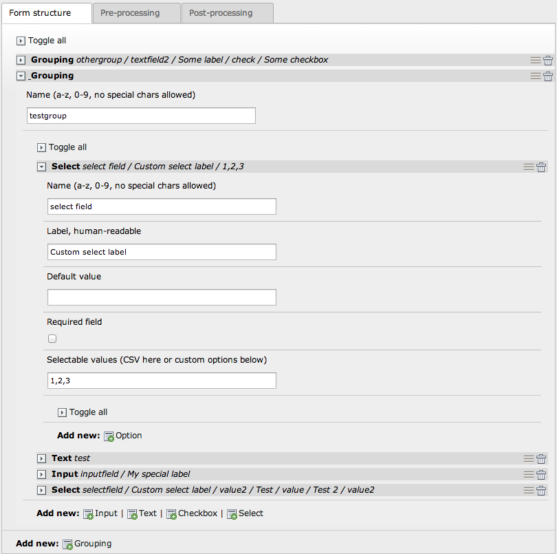
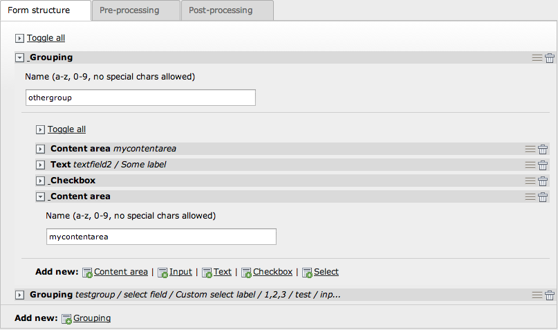
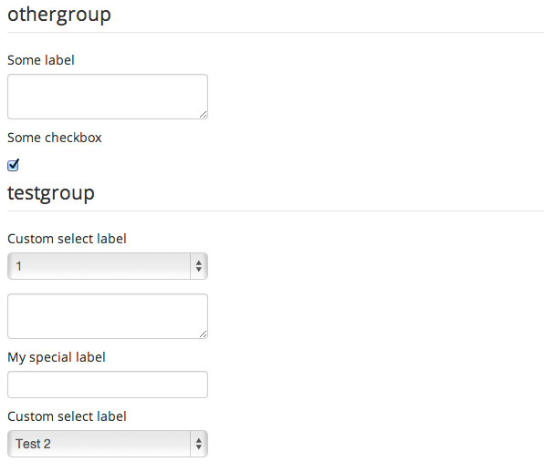

Fromage: Frontend Flux Forms
============================

> **Fromage** _(Fru-maaj; French for cheese)_ is a visual building tool to create flexible forms as content elements in TYPO3 CMS.

# Caveat Emptor!

This extension both uses highly experimental code, some not yet published. This README contains references to code and classes
still not released - the target release of a stable (perhaps beta) is scheduled to happen same time as Flux 7.0. Do not try to
use this extension yet, but feel free to browse source code and read this document.

## Fromage IS...

* Bleedin' friggin' edge - and **so very much NOT ready for practical use**. Don't say I didn't warn you. Stay tuned though.
* A _seriously rapid_ prototyping tool for creating forms TYPO3 can render in pages as content elements.
* Capable of actually using the form after the prototype stage - and easy to migrate to a true Extbase plugin with a Fluid form.
* Extremely easy to extend with new fields and ways to handle data.
* Built on standards, using standards: supports form protection tokens, controller argument mapping, TypeConverters etc.
* A possible replacement for Powermail, the built-in Form object and various (not overly complex) form extensions.

## Fromage is NOT...

* A true WYSIWYG - it is, in all its simple glory, a familiar (TCEforms-based) way to define which fields etc. a form contains.
  It has limitations this way, but it leverages standard TYPO3 UI components to create comforting familiarity.

## Fromage CAN...

* Save you a huge amount of time on development and perhaps more importantly, a great deal of frustration trying to twist existing
  form extensions to fit your needs.
* Call your own controllers, also from an existing extension, in order to process the submitted data - which means you can often
  use it instead of actual plugins, to make forms content editors can configure in great detail.
* Use content elements inside the form; these content elements being edited as nested content elements from fx Fluidcontent.
* Create things like search forms (e.g. forms which send variables to other plugins, other pages, etc).

## Fromage CANNOT...

* Solve every possible use case. Sometimes you do need a custom plugin. Fromage tries to reduce the need for custom plugins, not
  remove it altogether.

## Teaser screenshots

> _Structure editing experience_
>
> 

> _Using content elements nested inside form fields' structure_
>
> 

> _Editing content in nested content areas added contained in the form structure_
>
> 

> _Data Pipes management_
>
> 

> _Default template, rendered with Twitter Bootstrap CSS applied but using no CSS class names_
>
> 

## Concept

Fromage approaches forms by abstracting the concept of "forms" in a way that can be defined like this:

> Forms are a set of fields, possibly grouped together, which when submitted generate data which it is up to the server to handle.

This is then extracted to these basic concepts:

* Fields - of course. Without them you would get nowhere.
* Groupings - sets of fields that logically belong together, for example "Personal information" and "Contact information"

And these more advanced concepts (which are part of Flux):

* Outlets - which are classes that accept data in one end and "does something" to return data out the other end. They are not
  "Factories" as such; they only manage the _flow of some input data to produce other output data_.
* Pipes - which are the individual steps an Outlet can use. For example, one Pipe can transform an array to a Model object, the
  next Pipe can save that instance using a Repository, the Pipe after that can send an email to the user and the final Pipe can
  generate a FlashMessage which gets displayed to the user when they reach the receipt.

Regarding rendering, Fromage aims to decouple this as much as possible from any decisions the content editor makes regarding which
fields etc. the form should contain. In the simplest terms possible: the included templates are there to get something rendered.
Any special needs and you **will** need to replace one or more templates.

However, Fromage makes this very easy for you. It supports template paths like you know from any Extbase/Fluid extension. And it
supports the special "overlay" concept known from EXT:view (and which is also implemented in EXT:fluidpages and EXT:fluidcontent).
Basically "overlays" imply that rather than copy **all** template files to change one or more, you can copy **only** the ones you
actually need to change - and leave the rest as-is, where they are.

We'll get a lot deeper into these concepts in order to teach you how to use each and every one. Each concept is extremely simple
to learn - and combined, they are all you need to know about Fromage.

Before we really get started here are a few very nice-to-know facts about Fromage:

* Fromage uses the Flux Form components concept. You can actually define the Fromage form using a `flux:form` tag inside the
  template that renders the Fromage form (for those cases when you don't want to content editor to configure a big form but
  simply want them to enter a couple of key values and then do the heavy lifting using conditions etc. as you know from Flux).
* Fromage uses the Outlet and Pipe concepts from Flux - you can also use those in other Flux contexts, as a way to very quickly
  create a sequence of steps (Pipes) that process form data. Pipes you add for Fromage, incidentally, are also compatible with
  Pipes used in other Flux contexts.
* Since Fromage uses Flux forms, it has full-blown automatic LLL file writing for every field you create. When the content editor
  is done adding fields, they - or a developer - can go right ahead and start filling in translations in the LLL file which gets
  updated on-the-fly as long as Flux's LLL feature is enabled.

## A practical illustration case

Let's use a very basic contact form as example. Deconstructed into the four concepts above, a contact form might consist of:

* Contact form fields (a Grouping)
* A template which renders the fields in a nice way
* Some logic which validates that fx an email was entered (a Pipe; incoming - as opposed to outgoing Pipes, incoming Pipes are
  meant for **pre-processing** data; for example validating some values.
* Some logic which sends an email to the site owner (a Pipe; outgoing - executed after the incoming Pipes, the outgoing Pipes are
  meant for finalising data - for example, saving it in the database or file, sending an email as receipt and other **post-
  processing** concerns.

This means we must first of all construct a set of form fields. Fromage does this by making the content editor insert a plugin
which has a number of special sections into which objects (fields, field groups, Pipes etc) can be inserted.

Using this plugin's special sections, the content editor then inserts a `Grouping` and into this four fields: for name, email,
subject and comment. He then configures each field - is it required or not, what is its label and such - which when completed is
rendered in the frontend using a very basic (fallback style) template.

The editor then proceeds to add an _inbound Pipe_ which makes the form enforce the settings for required, email validation etc.
This Pipe is optional simply because you don't always require validation and - all things being equal - performance is better when
you can skip what you don't need. The editor then adds an _outbound Pipe_ which accepts the entered data and sends a simple email
to the site owner's mailbox.

Having completed these steps, the result is a fully functional contact form prototype (still requiring template work) which has
validation and handles sending of email. When submitted, the form disappears and an extremely simple "Thank you!" message receipt
is shown.

Later in this site's life the content editor then decides an email is not enough; the contact form submissions should also be
stored in a database record. The editor then edits the form plugin, adds an _outbound Pipe_ which saves data to a record, saves it
and is done with that.

This whole thing goes on for a while - the content editor manages to get submissions posted to a remote server, published as JSON,
saved as XML, saved as multiple record types. More fields get added: a checkbox to subscribe to newsletters which when checked,
causes a new _outbound Pipe_ to save yet another record in another table (for example: direct_mail subscribers). Our content
editor even goes so far as to add username and password fields and create two final _outbound Pipes_ to first turn the submitted
data into a FrontendUser object, then save this FrontendUser using the FrontendUserRepository.

Phew. That's one smart content editor right there. It's not that often you see one tiny contact form grow from a contact form
into a newsletter- and account-signup plugin with validation and saving using a Repository, sending receipt emails and creating
subscription records to the editors' hearts' desires. It started as a prototype, but assuming the designer did his work, it is
now a full-blown frontend plugin.

Our editor used visual programming along the way: creating sequences of inbound and outbound Pipes which process the data in
different ways, resulting in some final outcome.

But why stop here. We've only scratched the surface - _those were just the built-in components_. Later again, our dear content
editor decides he needs a completely custom field type. The smart content editor now calls his dev and points to the next section
of this README file.

## Illustrating the processing sequence

A Fromage form plugin instance will be processed in the following way - unless you specifically override some or all parts of this
sequence (see the section about developer's perspective - you can replace litteraly every single behaviour of Fromage).

### Backend context

1. Component types get added through `ext_localconf.php` scripts of Fromage and any other extensions providing components.
2. Components are then selected in Fromage plugin instances; Fields put into Groupings, Pipes in/out added, behaviors configured.
3. Form structure is saved along with the plugin instance, ready to be used by the frontend context, as content element (plugin).

### Frontend context

1. Form structure is fetched - either from the structure filled in by the content editor (recommended, most flexible to editors)
   or by a `flux:form` stored in a `Configuration` section in the template file used by the plugin - or even directly as PHP (the
   Flux Form component is at its a set of classes which can be instanciated manually, if needed).
2. Form instance is assigned to the template the plugin is configured to use.
3. Custom (highly recommended but not mandatory) or built-in templates then render field groups, fields, labels, help texts,
   buttons, alerts etc.
4. Fromage's controller accepts the posted data as array and calls upon the Outlet to produce a result.
5. The Outlet then calls upon any number of Pipes which either validate, transform or otherwise process (fx save, transmit, log)
   the data along the way.
6. When Outlet finishes passing data through Pipes, the user is redirected to a receipt which can either be a template or a custom
   page (wherein another Fromage plugin can be inserted which renders receipts only).

In simpler terms: a form's structure gets defined somewhere, then rendered using some template, to finally have submitted data
validated and processed in individually configured steps, called Pipes. With every component involved being replaceable by custom
ones created by developers.

## Digging deeper - the designer's perspective

In order to properly style a form (Fromage's purpose is not to deliver templates but to deliver integration logic only) you only
need to create Fluid templates and make sure the integrator configures Fromage to use those templates (this is done in completely
standardised ways, of course). You can naturally use the included templates as basis for your own; adding various container HTML
elements, CSS class names, custom labels from LLL which use arguments, etc.

This part of the task is very simple. In the template you will have a proper and exhaustive set of variables available to use,
containing information like field groups, field definitions (attributes like `size` and `placeholder`) and even a list of Pipes
added by the content editor - which, just as an example, allows you to display a special message if a particular Pipe is involved.
A specific example: our contact form may or may not always contain the Pipe which sends an email - in some incarnations, it could
instead implement a Pipe which saves a record. This could mean that you - the designer - think it best to display a small text
box next to the submit button if the email Pipe is detected, informing the user that their response gets sent to this and that
person, email, office, etc. rather than just stored in the system.

## Digging even deeper - the developers' perspective

If you are a developer you have hopefully already caught the points completely. If not, here's a very short recap about the four
concepts Fromage implements:

* Fields - classes which for example make a set of configuration fields (flexform style) to configure a basic ``<input>`` field
* Groupings - classes which contain sets of Field class instances, making a logical group of form fields.
* Pipes - classes which accept data in one end and returns the same data, the same data but changed - or completely new data.
* Outlets - classes which handle Pipes; Outlets take data in one end and uses a number of Pipes to produce data that is returned.

These concepts are then used as follows:

* Groupings and Fields become available to content editors who build the forms by putting Fields into Groupings.
* Pipes become available to content editors who can choose which Pipes (if any) to use in each form.

And decoupled from the backend editing interface,

* Outlets which are intended as the most fixed structure, only needing to be replaced if you have some seriously custom needs;
  an example of such a custom need might be an Outlet which is capable of reconfiguring or even replacing Pipes on-the-fly. You
  are a crazy dev like the rest of us, aren't you?

These are the four component types Fromage itself uses - and because one should always eat ones own dog food (as in: use oneself's
APIs and make the APIs tasty enough to enjoy), these types can all be replaced by your own custom classes. You don't like how the
email Pipe sends email? Fine - create a Pipe class of your own and tell Fromage to use it instead of the email Pipe. Want your
select fields to not be ``<select>`` but some crazy radio combo? Fine - create a Field class of your own and let Fromage use that
instead of the `select` type Field it contains. And so on, ad infinium.

Every example of how to register your classes, either as new components (which content editors can then start using immediately,
alongside existing components) or as replacements for existing components (which then take over the function of native components)
can be found in [ext_localconf.php](ext_localconf.php) and the doc comment of [FluidTYPO3\Fromage\Core](Classes/Core.php),
respectively. You use the exact same API to register your custom classes - except you register them using their full class name.

This is how extensible and flexible Fromage really is. An extremely slim code base with almost zero processing logic and litterally
every single step of the logic is completely replaceable as well as extendable by your own versions - without abusing XCLASS etc,
without the need for any hooks that cannot be controlled by a content editor - and unspeakable things even worse than those.

This concludes the README file for Fromage.
